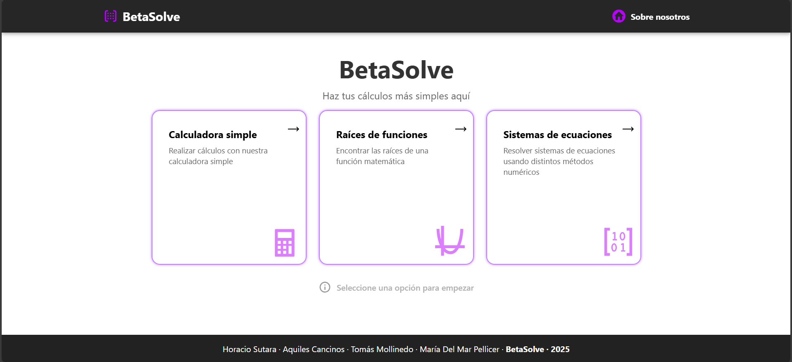
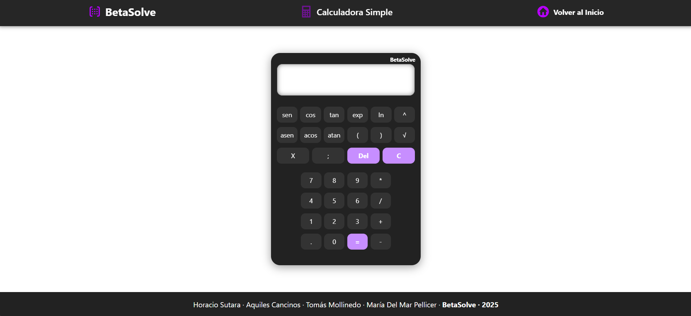
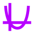
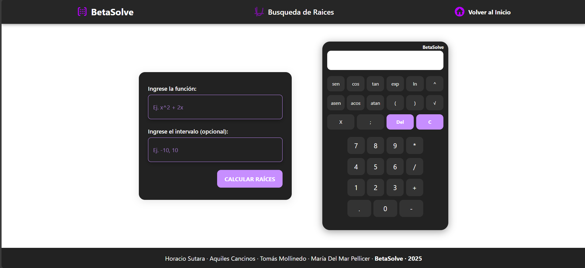
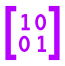
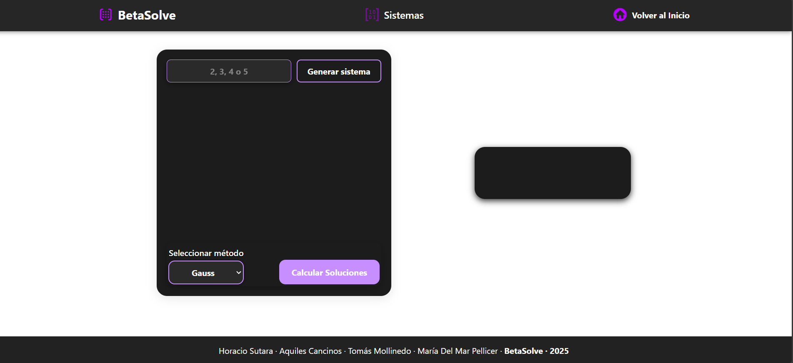

<h1>
  
  BetaSolve
</h1>

Una aplicación web interactiva y responsiva, diseñada para resolver problemas matemáticos utilizando enfoques visuales y didácticos.

---
## 📷 Captura de pantalla

### 🏠 Página principal


<h3>
  
  Calculadora basica
</h3>


<h3>
  
  Calculadora de Busqueda de Raices
</h3>


<h3>
  
  Calculadora de Sistema de Ecuaciones
</h3>



---
## 🎯 Objetivo

Fue diseñada para resolver problemas matemáticos de forma visual, comprensible y atractiva, enfocándose en la aplicación de métodos numéricos clásicos.
Su principal objetivo es hacer el aprendizaje más accesible a través de una plataforma que:

- Ofrece una interfaz simple y visualmente agradable

- Presenta el **procedimiento** paso a paso en la resolucion del sistema de ecuaciones.

- Utiliza visualizaciones **gráficas** de las funciones

- Presenta **tablas de iteraciones** que realiza los metodos numericos para llegar a la solucion
---

## 👨‍💻 Equipo de Desarrollo

- **Frontend**
  - Aquiles Cancinos
  - María del Mar Pellicer

- **Backend**
  - Tomás Mollinedo
  - Horacio Sutara

---

##  🧠 Funcionalidades Principales

**BETAsolve** incluye 3 herramientas matemáticas:

<h3>
  
  Calculadora basica
</h3>

Realiza operaciones aritméticas comunes y **evalua funciones** en puntos especificos para analisis rapidos.

Para evaluar una función en un punto específico, utiliza la siguiente sintaxis:
`función ; valor`

🔹 Ejemplo: `sin(x) + x^2 ; 3`. Evalua la funcion en `x=3`

<h3>
  
  Calculadora de Busqueda de Raices
</h3>

Encuentra ceros de funciones mediante **5 métodos numéricos**:
  - Bisección
  - Punto Fijo
  - Newton-Raphson
  - Secante
  - Regula falsi

✅ Permite ingresar funciones personalizadas, definir intervalos y visualizar gráficamente cada iteración.
💡 El sistema sugiere el método más eficiente según la función ingresada.
<h3>
  
  Calculadora de Sistema de Ecuaciones
</h3>

Resuelve sistemas de hasta **5 incógnitas** .El usuario puede **elegir el método deseado**:
  - Eliminación de Gauss
  - Gauss-Jordan
  - Seidel
  - Jacobi

📌 Permite introducir matrices, visualizar los pasos intermedios y comprender el proceso completo de resolución.

---

## 🛠️ Tecnologías Usadas

<h2 align="center">🛠️ Tecnologías Usadas</h2>
<p align="center">
  &nbsp;&nbsp;&nbsp;
  &nbsp;&nbsp;&nbsp;
  &nbsp;&nbsp;&nbsp;
  &nbsp;&nbsp;&nbsp;
  &nbsp;&nbsp;&nbsp;
  &nbsp;&nbsp;&nbsp;
  &nbsp;&nbsp;&nbsp;
</p>

<p align="center">
  <b>HTML5</b> &nbsp; • &nbsp;
  <b>CSS3</b> &nbsp; • &nbsp;
  <b>JavaScript</b> &nbsp; • &nbsp;
  <b>Python</b> &nbsp; • &nbsp;
  <b>Flask</b> &nbsp; • &nbsp;
  <b>NumPy</b> &nbsp; • &nbsp;
  <b>Matplotlib</b>
</p>
---

## 🔧 Instalación y Ejecución

### ✅ Requisitos Previos

- Python 3.8 o superior
- pip
- Navegador web moderno (Chrome,Microsoft Edge, Firefox, etc.)

---

### ⚙️ Configuración del entorno

1. **Clonar el repositorio** y navegar al directorio:

2. **Crear y activar un entorno virtual:**
```bash
python -m venv venv
# En Windows:
venv\Scripts\activate
# En macOS/Linux:
source venv/bin/activate
```
3. **Instalar las dependencias**
```bash
pip install -r requirements.txt
```
4. **Iniciar el servidor Flask:**
```bash
python app.py
```
5. **Abre tu navegador** y accede a: http://127.0.0.1:5000
